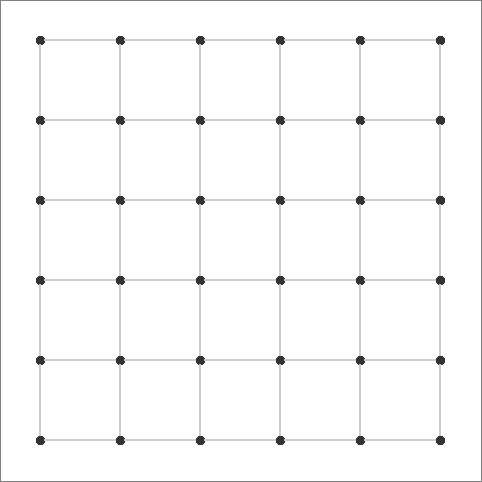

# Dots and Boxes AI Agent

A state-of-the-art Deep Q-Network (DQN) implementation for mastering the classic Dots and Boxes game.

## See It In Action



*Watch our trained DQN agent (Player 1 - Blue) dominate against a random agent (Player 2 - Red) in real-time! The AI demonstrates strategic thinking by setting up chain completions and maximizing box captures.*

---

## Project Overview

This project implements a state-of-the-art AI agent that learns to play Dots and Boxes through deep reinforcement learning. The agent uses a Dueling DQN architecture with prioritized experience replay, achieving impressive performance across different grid sizes.

### Key Features

- **Advanced DQN Architecture**: Dueling DQN with batch normalization and dropout
- **Prioritized Experience Replay**: Efficient learning from important experiences
- **Multi-Grid Support**: Configurable grid sizes (2×2 to 5×5)
- **Interactive GUI**: Real-time game visualization and agent comparison
- **Comprehensive Benchmarking**: Detailed performance analysis and statistics
- **GIF Recording**: Create animated recordings of your AI in action
- **Modular Design**: Clean, extensible codebase with clear separation of concerns

## Project Structure

```
dots-and-boxes-ai/
├── environment.py      # Game environment implementation
├── models.py          # Neural network models (DQN, Replay Buffer)
├── agent.py           # DQN agent and random agent implementations
├── gui.py             # Interactive game visualization
├── benchmark.py       # Performance benchmarking tools
├── make_gif.py        # GIF recording for creating demos
├── utils.py           # Utility functions
├── main.py            # Main training and evaluation script
└── README.md          # This file
```

## Quick Start

### Installation

1. **Clone the repository**:
   ```bash
   git clone https://github.com/SanketRt/dabi.git
   cd dabi
   ```

2. **Install dependencies**:
   ```bash
   pip install -r requirements.txt
   ```

3. **Install the package** (optional):
   ```bash
   pip install -e .
   ```

## Usage

### Training Your Agent
```bash
python main.py --train --episodes 3000 --grid-size 3
```

### Interactive GUI Demo
```bash
python gui.py
```

### Performance Benchmarking
```bash
python benchmark.py
```

### Create Your Own GIFs
```bash
python make_gif.py
```
Then follow the GUI to:
1. Select your trained model
2. Choose game settings
3. Launch the recorder
4. Start recording and play a game
5. Save your animated GIF!

### Quick Demo
```bash
python benchmark.py demo
```

## Algorithm Details

### DQN Architecture

The agent uses a **Dueling DQN** architecture with the following components:

- **Feature Extraction**: Dense layers with batch normalization and dropout
- **Value Stream**: Estimates state value V(s)
- **Advantage Stream**: Estimates action advantages A(s,a)
- **Q-Value Combination**: Q(s,a) = V(s) + A(s,a) - mean(A(s,a))

### Training Features

- **Prioritized Experience Replay**: Samples important experiences more frequently
- **Target Network**: Stabilizes training with periodic updates
- **Epsilon-Greedy Exploration**: Balances exploration and exploitation
- **Gradient Clipping**: Prevents exploding gradients
- **Reward Clipping**: Bounded rewards for stable learning

### Reward Structure

The environment provides shaped rewards to guide learning:

| Action | Reward | Cap | Description |
|--------|--------|-----|-------------|
|  **Box Completion** | +0.5 per box | +2.0 | Encourages box capturing |
|  **Creating 3-Edge Box** | -0.1 penalty | -0.5 | Discourages gift setups |
|  **Regular Move** | -0.01 | - | Encourages efficiency |
|  **Win/Loss** | ±1.0 | - | Final outcome bonus |
|  **Score Margin** | ±0.5 × tanh(diff) | - | Proportional victory bonus |
|  **Invalid Move** | -1.0 | - | Prevents illegal actions |

##  Performance Results

### 5×5 Grid Championship Results

| Matchup |  Win Rate |  Avg Game Length | Performance |
|------------|-------------|-------------------|----------------|
| **DQN vs Random** | **98.0%** | 60.0 moves | 🔥 Dominant |
| **DQN vs DQN** | 50.0% | 60.0 moves | ⚖️ Balanced |
| **Random vs Random** | 50.5% | 60.0 moves | 📊 Baseline |

### Key Insights

- **Superhuman Performance**: 98% win rate against random opponents
- **Strategic Play**: Consistently achieves near-optimal game lengths
- **Balanced Self-Play**: Fair competition in DQN vs DQN matches
- **Lightning Fast**: ~0.02s per game on average hardware

## Creating Demo GIFs

Want to showcase your AI's performance? Use our built-in GIF recorder:

1. **Launch the GIF Recorder**:
   ```bash
   python make_gif.py
   ```

2. **Configure Your Demo**:
   - Select your trained model (.pth file)
   - Choose grid size and game speed
   - Set player assignments (DQN vs Random, etc.)

3. **Record Your Game**:
   - Click "Launch Game Recorder"
   - Start recording before beginning the game
   - Watch your AI play and stop recording when done
   - Save as an optimized GIF

4. **Share Your Results**:
   - Add the GIF to your README
   - Share on social media
   - Include in presentations

### GIF Recording Tips

- **Quality**: Use "Slow" or "Very Slow" speeds for clearer recordings
- **Size**: Keep recordings under 100 frames for smaller file sizes
- **Loop**: GIFs automatically loop for continuous demonstration
- **Compatibility**: Works on all platforms with PIL/Pillow installed

## Configuration

The project uses YAML configuration files for easy parameter tuning:

```yaml
# configs/training.yaml
training:
  episodes: 3000
  batch_size: 64
  learning_rate: 5e-4
  gamma: 0.95
  epsilon_start: 1.0
  epsilon_end: 0.01
  epsilon_decay: 0.995

model:
  hidden_size: 512
  dropout_rate: 0.1
  
environment:
  grid_size: 3
  reward_clipping: [-3.0, 3.0]
```

## Monitoring Training

Monitor training progress with built-in visualization:

- **Real-time Metrics**: Win rate, average reward, loss curves
- **Tensorboard Support**: Detailed training logs
- **Automatic Checkpointing**: Best model saving
- **Performance Plots**: Generated training visualizations

## 🎮 Game Rules

**Dots and Boxes** is a classic paper-and-pencil game:

1. Players take turns drawing lines between adjacent dots
2. When a player completes a box (4 edges), they score a point and take another turn
3. The game ends when all possible lines are drawn
4. The player with the most boxes wins

###  Strategic Elements

- **Chain Rule**: Completing boxes often creates opportunities for more boxes
- **Sacrifice Strategy**: Sometimes giving away boxes to maintain control
- **Endgame Planning**: Managing the final box completions

##  Research Background

This implementation is based on several key papers:

- **DQN**: Mnih et al. (2015) - Human-level control through deep reinforcement learning
- **Dueling DQN**: Wang et al. (2016) - Dueling Network Architectures for Deep Reinforcement Learning
- **Prioritized Replay**: Schaul et al. (2016) - Prioritized Experience Replay
